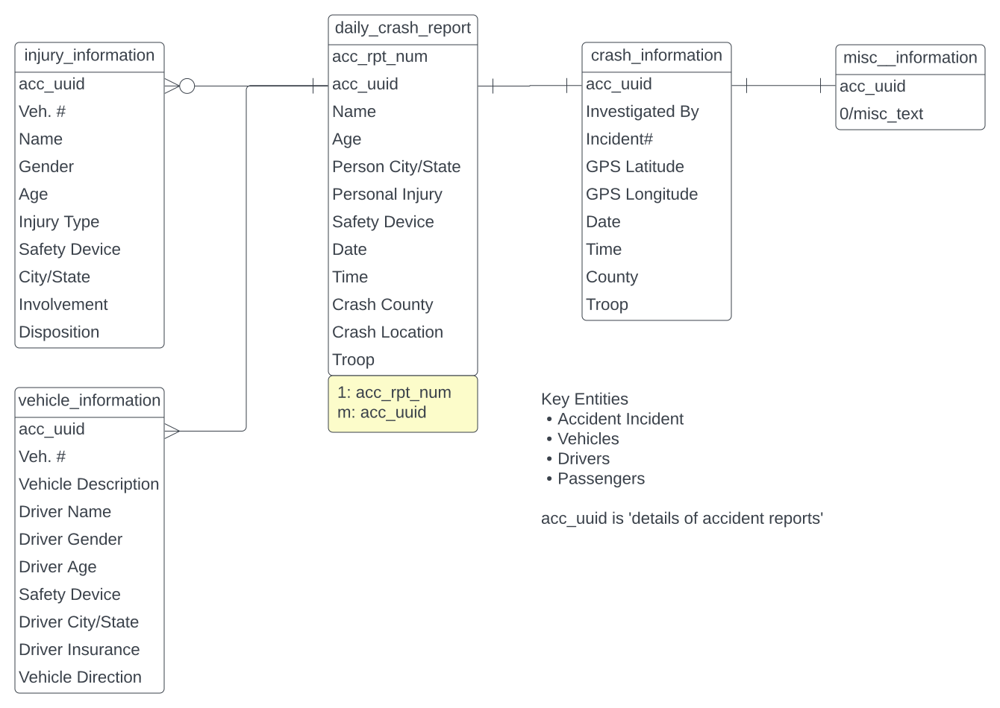

# Explainability Tutorials & Libraries

## Raw Data - Missouri Highway Patrol Accident Data
Leveraging a real data set scrapped from [MSHP](https://www.mshp.dps.missouri.gov/HP68/SearchAction)

The base schema is:

## Exploratory Data Analysis
Leverage following core libraries
* Generate Automated Reports
  * [dataprep](https://docs.dataprep.ai/index.html#) - last update Jul 7th
  * [SweetViz](https://pypi.org/project/sweetviz/) - last update June 8th
  * [pandas profiling](https://pypi.org/project/pandas-profiling/)
  * [ydata-profiling - replace pandas profiling](https://github.com/ydataai/ydata-profiling) - last update a couple days ago <-- does Spark too
* Exploratory Inspections
  * [Lux](https://github.com/lux-org/lux)
  * [Chart Me](https://pypi.org/project/chart_me/) 
* Explore other candidates
  * [autoviz](https://pypi.org/project/autoviz/)
  * [yopo](https://pypi.org/project/yopo/)

## Data Cleansing and Feature Engineering
  * [dataprep](https://docs.dataprep.ai/index.html#)

## Microsofts InterpretML
[Interpret.Ml](https://interpret.ml/)
[Whitepaper](https://www.microsoft.com/en-us/research/uploads/prod/2020/05/InterpretML-Whitepaper.pdf)
InterpretML helps users gain a better understanding of their model's overall behavior 
* (“global explanation”), understand the reasons behind
* individual predictions (“local explanation”), and debug their model’s predictions by exploring what
* similar data instances have received different outcomes.
**Explainable Boosting Machine (EBM)**
* EBMs produce exact explanations and are editable by domain experts.

* Interpretability Technique	Type
  * Explainable Boosting	glassbox model
  * Decision Tree	glassbox model
  * Decision Rule List	glassbox model
  * Linear/Logistic Regression	glassbox model
  * SHAP Kernel Explainer	blackbox explainer
  * LIME	blackbox explainer
  * Morris Sensitivity Analysis	blackbox explainer
  * Partial Dependence	blackbox explainer

